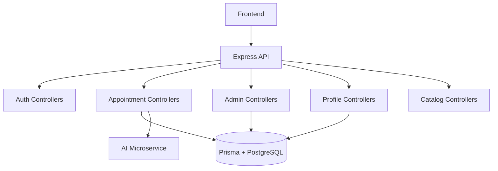

# Backend Setup and Usage

## Scope
Backend service in `backend/` built with Express (ESM), Prisma, and PostgreSQL.

## Technologies
- Node.js (ES Modules)
- Express 5
- Prisma ORM + `@prisma/client`
- PostgreSQL (Neon adapter)
- Auth: JWT + HTTP-only cookie (`triveda_auth`)

## Prerequisites
- Node.js 18+
- pnpm or npm (backend supports both; repo often uses pnpm)
- PostgreSQL connection URL (`DATABASE_URL` or `DIRECT_URL`)

## Install
```bash
cd backend
pnpm install
```

## Environment Variables
Create `backend/.env`:
```env
PORT=5000
FRONTEND_URL=http://localhost:5173
DATABASE_URL=postgresql://...
DIRECT_URL=postgresql://...
JWT_SECRET=change_me
AI_MICROSERVICE_URL=http://localhost:8000
NODE_ENV=development
```

## Run
```bash
cd backend
pnpm dev
```

## Prisma
- Prisma schema path: `backend/prisma/schema.prisma`
- Generated client output: `backend/src/generated/prisma`

Commands:
```bash
cd backend
npx prisma generate
npx prisma migrate dev
```

## Seeds/Utilities
Available scripts from `backend/package.json`:
- `pnpm dev` - start development server
- `pnpm start` - start production-like mode
- `pnpm seed:doctors` - doctor seed helper
- `pnpm backfill:diet` - diet backfill
- `pnpm backfill:lifecycle` - lifecycle backfill

## API Mount Points
From `backend/src/app.js`:
- `/api/auth`
- `/api/appointments`
- `/api/admin`
- `/api/profile`
- `/api/catalogs`

## Backend Health Check
```http
GET /
```
Expected response: Prisma connection status payload.

## HLD


## LLD Highlights
- DB client bootstrap: `backend/src/db/config.js`
- Error abstraction: `ApiError`, `ApiResponse`, `asyncHandler`
- Auth token generation: `generateTokenAndSetCookie()` in `auth.controller.js`
- Appointment writes use transactions in `saveDoctorPlan()` for consistency across:
  - `Appointment`
  - `TreatmentPlan`
  - `TreatmentPlanLifecycle`
  - `TreatmentPlanDomainConfig`
  - `DietPlan` and `DietItem`
  - `TreatmentMedication`
