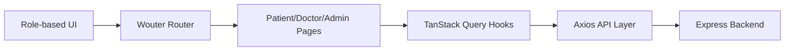

# Frontend Setup and Usage

## Scope
Frontend application in `frontend/` using React + Vite + TypeScript.

## Technologies
- React 18
- Vite
- TanStack Query
- Wouter routing
- Axios API client
- Tailwind + component primitives (Radix + custom UI)

## Package Manager Note
This workspace uses `pnpm` (lockfile present). Prefer `pnpm` in `frontend/`.

## Install
```bash
cd frontend
pnpm install
```

## Run
```bash
cd frontend
pnpm dev
```
Default Vite port is typically `5173`.

## Build
```bash
cd frontend
pnpm build
pnpm preview
```

## API Integration
- Axios client: `frontend/client/src/api/client.ts`
- Base URL: `/api` (proxied to backend)
- API response unwrapping convention:
  - backend returns `{ statusCode, data, message }`
  - frontend interceptor returns `response.data.data`

## Auth and Session Behavior
- Login hooks store user metadata in localStorage key `triveda_user`.
- Cookie-based auth support exists on backend.
- API calls are centralized in feature-specific API modules.

## HLD


## LLD Highlights
- App entry: `frontend/client/src/main.tsx`
- Route map: `frontend/client/src/App.tsx`
- Query cache config: `frontend/client/src/lib/queryClient.ts`
- Key feature hooks: `frontend/client/src/hooks/useAppointments.ts`, `useAuth.ts`

## Role Routes Summary
- Patient routes start with `/patient/*`
- Doctor routes start with `/doctor/*`
- Admin routes start with `/admin/*`
