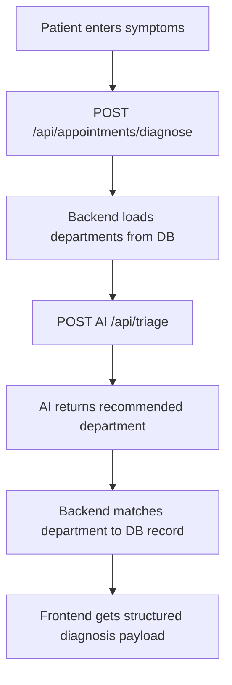
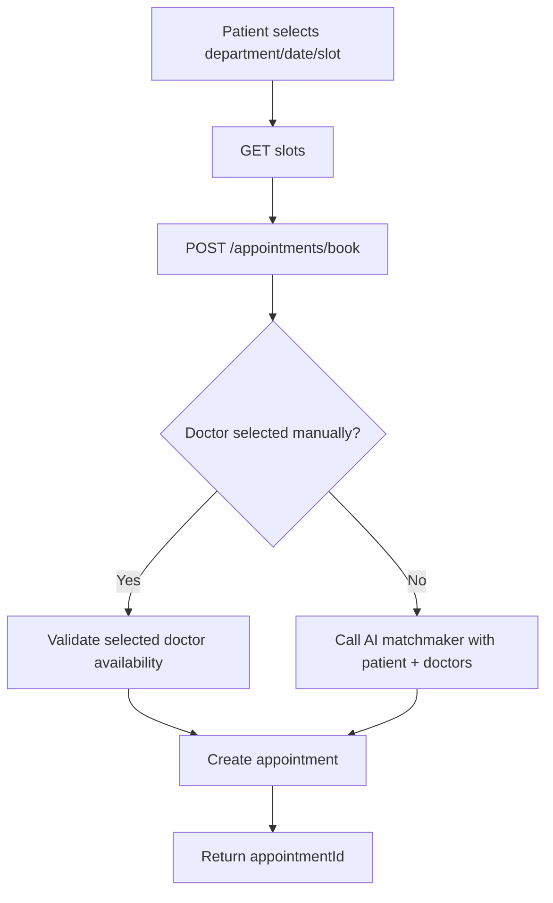
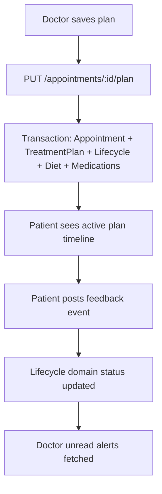
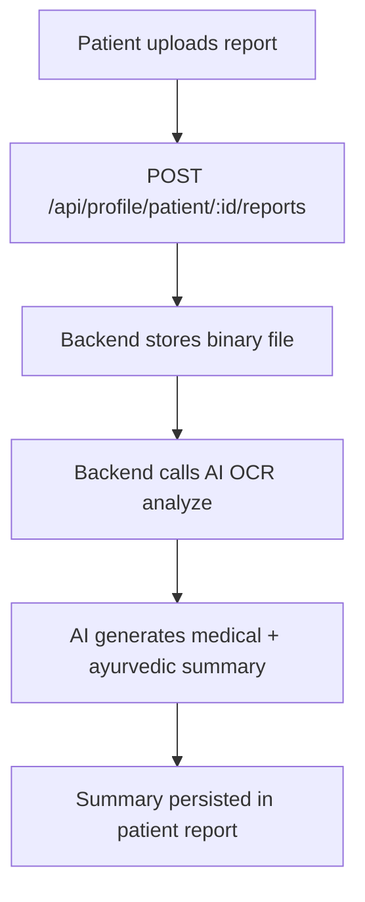
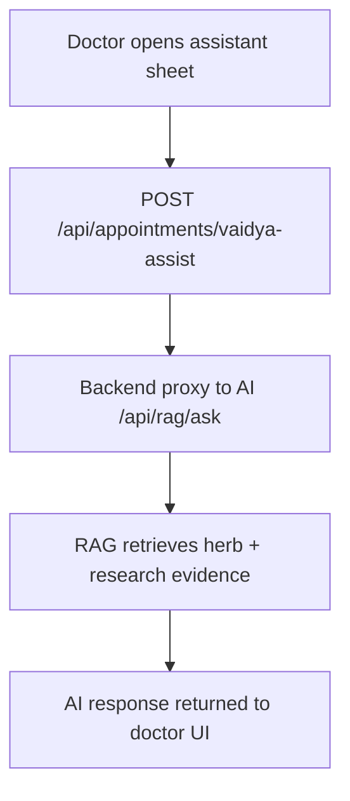

# Integration Flow (HLD + LLD Bridge)

## Key Integration Paths
1. Appointment diagnosis flow
2. Appointment booking and doctor assignment flow
3. Treatment planning and lifecycle feedback flow
4. Patient report OCR upload and analysis flow
5. Vaidya Assist RAG chat flow

## 1) Diagnosis + Department Suggestion

Important data:
- Input: `problemDescription`, `providedSymptoms`, `providedSeverity`, `providedDuration`
- Output: `final_symptoms`, `dosha_indicator`, `recommended_department_name`, `matchedDepartment`

## 2) Appointment Booking

Important fields:
- `appointment.patientId`, `appointment.doctorId`, `scheduledAt`, `status`, `aiSummary`

## 3) Treatment Plan + Feedback Lifecycle

Plan domains:
- `diet`
- `asanas`
- `medicines`

Feedback types:
- `working`
- `not_effective`
- `terminate_request`
- `stopped`

## 4) Patient Report OCR

## 5) Vaidya Assist (RAG)

