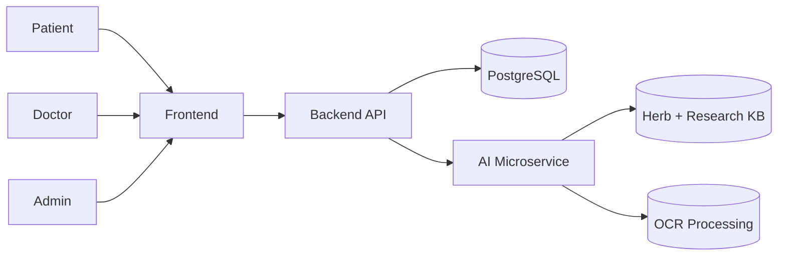
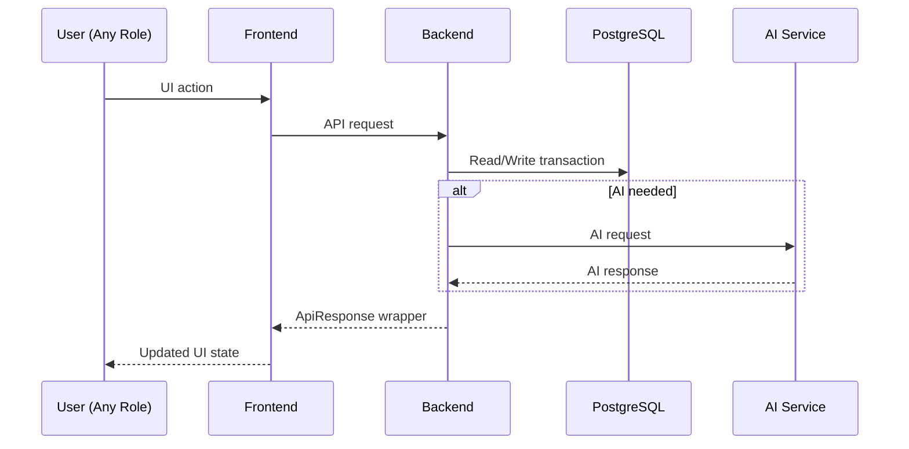

# System HLD (High-Level Design)

## Objective
TriVeda is a multi-role Ayurvedic healthcare platform with three main user sides:
- Patient side
- Doctor side
- Admin side

## Context Diagram

## Subsystems
1. Frontend (React)
- Role-specific dashboards and workflows.
- Uses TanStack Query + Axios API wrappers.

2. Backend (Express + Prisma)
- Business logic and RBAC-adjacent role split.
- Persistence and transactional consistency.

3. AI Microservice (FastAPI)
- Triage, RAG assistant, OCR analysis.

4. Data Layer (PostgreSQL)
- Core transactional entities and plan lifecycle objects.

## Request Lifecycle

## Non-Functional Highlights
- Modularity by feature (controllers/routes).
- API-level validation and sanitization in controller boundaries.
- JSON fields for flexible clinical/treatment structures.
- AI dependency isolated behind backend gateway calls.

## Risks and Notes
- Matchmaker endpoint contract should be validated across backend and AI service deployments.
- OCR and RAG startup dependencies can fail independently; health monitoring is required.
