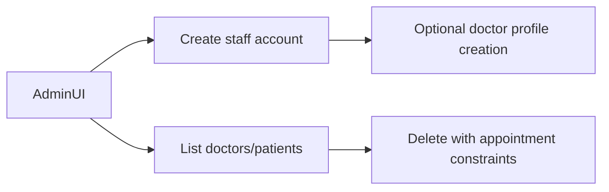

# Admin Side Module

## Goals
- Hospital staff and doctor provisioning
- Department-linked doctor management
- High-level patient and provider visibility
- Platform operational governance

## Major Components
- `AdminDashboard.tsx`
- `AdminRegistration.tsx`
- `AdminSettings.tsx`
- supporting pages: `WellnessCenterNetwork.tsx`, `PrakritiFinalization.tsx`

## Core APIs Used
- `/api/admin/create-staff`
- `/api/admin/staff-email-availability`
- `/api/admin/departments`
- `/api/admin/doctors`
- `/api/admin/patients`
- `/api/admin/doctors/:doctorId` (delete)
- `/api/admin/patients/:patientId` (delete)

## HLD Flow

## LLD Highlights
- Admin resolves `hospitalId` from authenticated admin cookie when possible.
- `createStaff` supports multiple staff roles; doctor role requires:
  - `specialization`
  - `departmentId`
- Temporary password generation pattern:
  - `Doc-<randomHex>`

## Constraints and Safeguards
- Staff email uniqueness checks before account creation.
- Doctor/patient deletion blocked if related appointments exist.
- Role validation ensures portal segregation.
