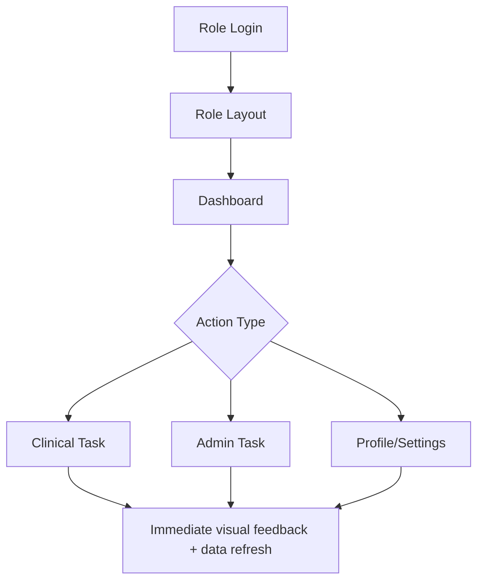

# Frontend Components and UX Rationale

## Objective
Document key component choices and how each improves user experience for healthcare workflows.

## Design Baseline
Referenced from `frontend/design_guidelines.md`:
- Healthcare-first visual hierarchy
- High readability and trust-building UI language
- Role-specific information density

## Component Families

## 1) Layout Components
- `layout/AppLayout.tsx` (patient)
- `layout/DoctorAppLayout.tsx`
- `layout/AdminAppLayout.tsx`

UX value:
- Stable navigation and context for each role.
- Reduces task switching friction by keeping role-focused sidebars/actions.

## 2) Dashboard Components
- `PatientDashboard.tsx`
- `DoctorDashboard.tsx`
- `AdminDashboard.tsx`

UX value:
- Fast status scanning (appointments, plans, alerts).
- Aggregated widgets reduce clicks to common actions.

## 3) Form + Assessment Components
- `PatientRegistration.tsx`, `DoctorRegistration.tsx`, `AdminRegistration.tsx`
- `PrakritiAssessment.tsx`, `PrakritiVerification.tsx`, `PrakritiFinalization.tsx`

UX value:
- Structured multi-step capture lowers data-entry errors.
- Progressive disclosure keeps complex clinical collection manageable.

## 4) Clinical Plan Components
- `DietChartGenerator.tsx`
- `PatientDietCharts.tsx`, `PatientAsanas.tsx`, `PatientMedicines.tsx`
- `PatientPlanInsights.tsx`

UX value:
- Separating diet/asanas/medicine views reduces cognitive overload.
- Plan segmentation maps directly to treatment lifecycle domains.

## 5) Communication + Assistive Components
- `consultation/VaidyaAssistBot.tsx`
- `ui/toaster`, modal/sheet components

UX value:
- In-context AI support prevents workflow interruption.
- Toast and sheet patterns provide immediate feedback without full-page navigation.

## 6) Data Interaction Components
- Tables/cards in doctor/admin views
- Query-driven lists with refetch + invalidation

UX value:
- Real-time-ish updates for clinical confidence.
- Reduced stale-data risk for appointment and treatment decision points.

## UX Flowchart

## Important Frontend State Keys
- `localStorage.triveda_user`: lightweight session identity and role context
- Query keys:
  - `appointments`
  - `doctorPatients`
  - `patientAppointments`
  - `patientDashboard`
  - `patientTreatmentPlan`

## Accessibility and Reliability Notes
- Medical UIs must preserve contrast, legibility, and explicit status labels.
- Validation and error toasts are essential for trust in patient/doctor workflows.
