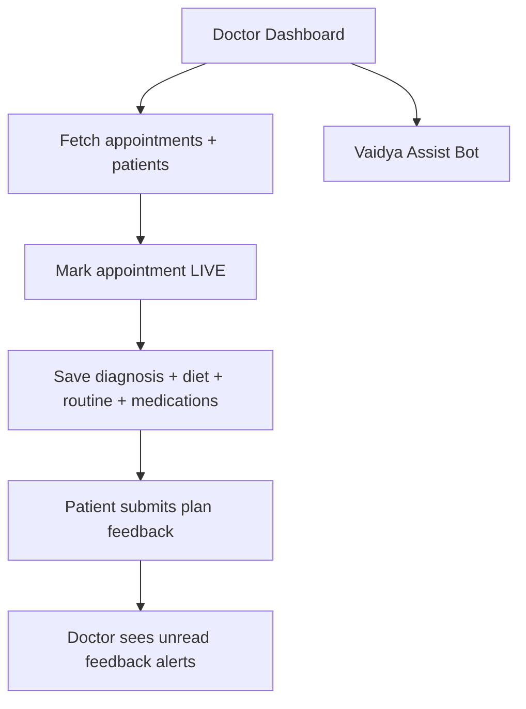

# Doctor Side Module

## Goals
- View and triage appointments
- Start live consultations
- Build and save treatment plans
- Monitor patient treatment feedback
- Access AI assistant for clinical support

## Major Components
- `DoctorDashboard.tsx`
- `DoctorAppointmentsFlow.tsx`
- `DoctorProfile.tsx`
- `DietChartGenerator.tsx`
- `Monitoring.tsx`
- `PrakritiVerification.tsx`
- `consultation/VaidyaAssistBot.tsx`

## Core APIs Used
- `/api/appointments/doctor/:doctorId`
- `/api/appointments/:appointmentId/live`
- `/api/appointments/:appointmentId/plan`
- `/api/appointments/doctor/:doctorId/treatment-plan/feedback`
- `/api/appointments/vaidya-assist`
- `/api/profile/doctor/:id`

## HLD Flow

## LLD Treatment Plan Object
Doctor plan payload includes:
- `doctorNotes`
- `diagnosis`: `finalPrakriti`, `finalVikriti`, `chiefComplaint`
- `dietChart`: `items`, `pathya`, `apathya`, `selectedFoods[]`
- `routinePlan`: `sleepSchedule`, `exercisesAndAsanas`, `therapy`, `tests`
- `medications[]`: `name`, `dosage`, `timing`, `medicineType`, `durationDays`, `doctorNotes`
- `planLifecycle` domain configuration

## UX Notes
- Design emphasizes direct patient context and rapid clinical actions.
- Query invalidation after save minimizes stale treatment visibility.
- Embedded assistant improves decision support without leaving consult context.
