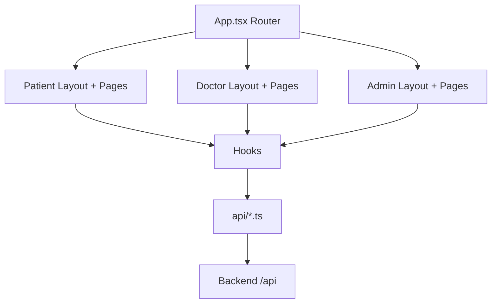

# Frontend Overview

## Purpose
Role-based experience layer for patients, doctors, and admins.

## Structure
- App root: `frontend/client/src/App.tsx`
- Routing: Wouter `Switch` with role-specific route groups
- Data layer: TanStack Query hooks + Axios API wrapper
- UI composition: layouts + feature components

## Route Groups
- Patient: `/patient/*`
- Doctor: `/doctor/*`
- Admin: `/admin/*`

## HLD

## LLD
### Important runtime modules
- `api/client.ts`: Axios instance and response/error normalization.
- `hooks/useAppointments.ts`: query/mutation orchestration + invalidation.
- `hooks/useAuth.ts`: login and role-based redirects.

### Cache invalidation patterns
On treatment updates, frontend invalidates:
- `appointments`
- `doctorPatients`
- `patientAppointments`
- `patientDashboard`
- `patientTreatmentPlan`

## Setup and Usage
- See `../00-setup/frontend-setup.md` for install/run/build.
- Keep API contract aligned with backend `ApiResponse` wrapper shape.
