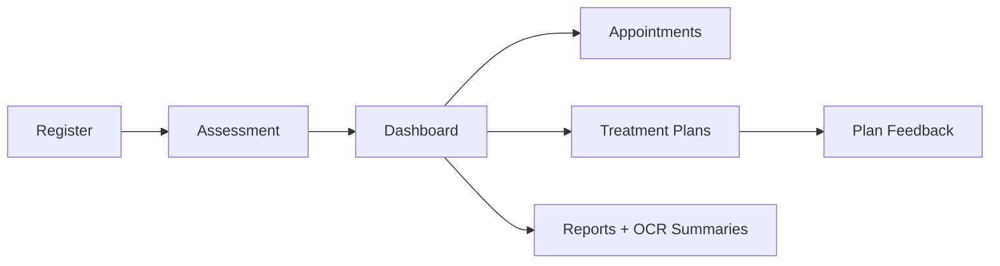

# Patient Side Module

## Goals
- Patient onboarding and profile setup
- Prakriti assessment and personalized tracking
- Appointment booking and management
- Treatment plan visibility and feedback
- Health report upload and summaries

## Major Components
- `PatientRegistration.tsx`
- `PrakritiAssessment.tsx`
- `PatientDashboard.tsx`
- `PatientAppointmentsMain.tsx`, `PatientAppointments.tsx`
- `PatientDietCharts.tsx`, `PatientAsanas.tsx`, `PatientMedicines.tsx`
- `PatientReports.tsx`, `PatientHealthRecords.tsx`, `PatientProfile.tsx`, `PatientSettings.tsx`

## Core APIs Used
- `/api/auth/patient/register`, `/api/auth/patient/login`
- `/api/appointments/patient/:patientId/*`
- `/api/profile/patient/:id`
- `/api/profile/patient/:id/reports`

## HLD Flow

## LLD Data Contracts
### Prakriti Assessment Payload
- Answers: `answer1` .. `answer8`
- Scores: `vataScore`, `pittaScore`, `kaphaScore`
- Result: `primaryDosha`, `timeSpentSec`

### Patient Dashboard Aggregates
Backend sends combined payload with:
- `patient` card data
- mapped appointment list
- latest `dietChart`
- `medications`
- `healthRecords`, `goals`, `dailySchedule`, `notifications`

### Appointment lifecycle states rendered in UI
- `SCHEDULED`
- `LIVE`
- `COMPLETED`
- `CANCELLED`

## UX Notes
- Frequent refetch intervals keep clinical timelines fresh.
- Separate pages reduce cognitive overload for treatment details.
- LocalStorage keeps lightweight session identity for route continuity.
