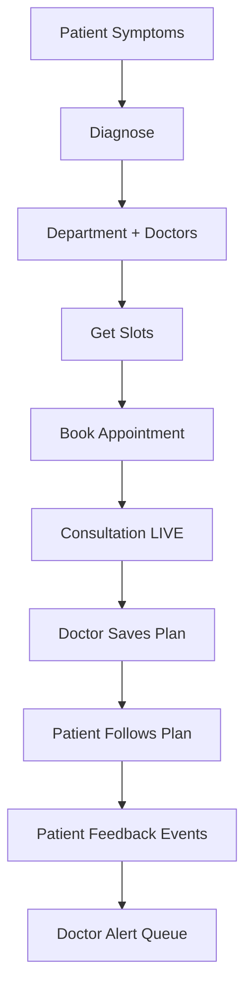

# Appointments and Treatment Lifecycle Module

## Scope
Primary implementation in `controllers/appointment.controller.js`.

## Major Functional Areas
1. Symptom diagnosis and department recommendation
2. Doctor availability and slot calculation
3. Appointment booking and assignment
4. Doctor treatment plan persistence
5. Patient timeline and treatment feedback
6. Prakriti assessment persistence

## Endpoint Summary
- `POST /api/appointments/diagnose`
- `POST /api/appointments/vaidya-assist`
- `GET /api/appointments/departments`
- `GET /api/appointments/doctors`
- `GET /api/appointments/slots`
- `POST /api/appointments/book`
- `PUT /api/appointments/:appointmentId/plan`
- `PUT /api/appointments/:appointmentId/live`
- `GET /api/appointments/doctor/:doctorId`
- `GET /api/appointments/doctor/:doctorId/patients`
- `GET /api/appointments/patient/:patientId`
- `GET /api/appointments/patient/:patientId/dashboard`
- `GET /api/appointments/patient/:patientId/treatment-plan`
- `GET /api/appointments/patient/:patientId/treatment-plan/timeline`
- `POST /api/appointments/patient/:patientId/treatment-plan/feedback`
- `GET /api/appointments/doctor/:doctorId/treatment-plan/feedback`
- `PUT /api/appointments/doctor/:doctorId/treatment-plan/feedback/:feedbackId/read`
- `PUT /api/appointments/patient/:patientId/:appointmentId/reschedule`
- `DELETE /api/appointments/patient/:patientId/:appointmentId`
- `POST /api/appointments/patient/:patientId/prakriti-assessment`
- `GET /api/appointments/patient/:patientId/prakriti-assessment`

## HLD (Primary Clinical Flow)

## LLD (Plan Save Transaction)
`saveDoctorPlan()` writes atomically:
- `Appointment` updates
- `TreatmentPlan` upsert
- `TreatmentPlanLifecycle` upsert
- `TreatmentPlanDomainConfig` refresh
- `DietPlan` + `DietItem` recreation
- `TreatmentMedication` recreation

This prevents partial treatment updates.

## Plan Lifecycle Domain Model
Domains:
- `diet`
- `asanas`
- `medicines`

Statuses:
- `ACTIVE`, `WORKING`, `NOT_EFFECTIVE`, `STOP_REQUESTED`, `STOPPED`, `COMPLETED`, `SUPERSEDED`

Feedback types:
- `WORKING`
- `NOT_EFFECTIVE`
- `TERMINATE_REQUEST`
- `STOPPED`

## Important Input Variables
- `selectedTimeSlots[]`, `date`, `departmentId`, `doctorId`
- `finalSymptoms`, `severity`, `duration`, `problemDescription`
- `planLifecycle.feedbackSettings.*`
- `dietChart.selectedFoods[]`

## Slot Logic Highlights
- Uses fixed candidate slots (`ALL_POSSIBLE_SLOTS`).
- Filters past slots and overbooked slots by doctor count capacity.
- Excludes cancelled appointments for capacity calculations.

## Doctor Assignment Highlights
- Manual doctor selection path validates doctor availability in department.
- Automatic path attempts AI matchmaker and falls back gracefully.
