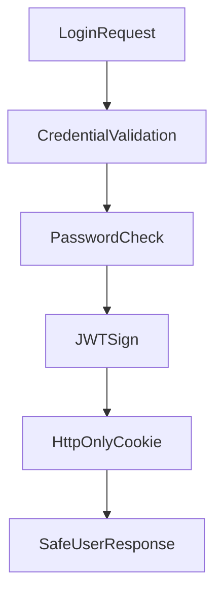

# Backend Authentication Module

## Scope
Implemented in:
- `controllers/auth.controller.js`
- `routes/auth.routes.js`

## Endpoints
- `POST /api/auth/staff/login`
- `POST /api/auth/patient/login`
- `POST /api/auth/patient/register`
- `POST /api/auth/logout`
- `PUT /api/auth/change-password`

## Token Model
JWT payload fields:
- `id`
- `role`
- `email`

Cookie settings for `triveda_auth`:
- `httpOnly: true`
- `sameSite: strict`
- `secure` based on production mode
- Expiry: 7 days

## HLD Flow

## LLD Notes
### Patient registration logic
- Validates required fields and password length.
- Normalizes email and computes age from DOB.
- Hashes password with bcrypt.
- Supports upsert-like behavior if patient row exists but app registration is incomplete.

### Password change logic
- Requires current and new password.
- Verifies old password before update.
- Supports both staff and patient paths.

## Important Variables/Fields
- `isAppRegistered` in `Patient`
- `StaffRole` enum for access segregation
- `triveda_auth` cookie name
- `JWT_SECRET` environment variable
