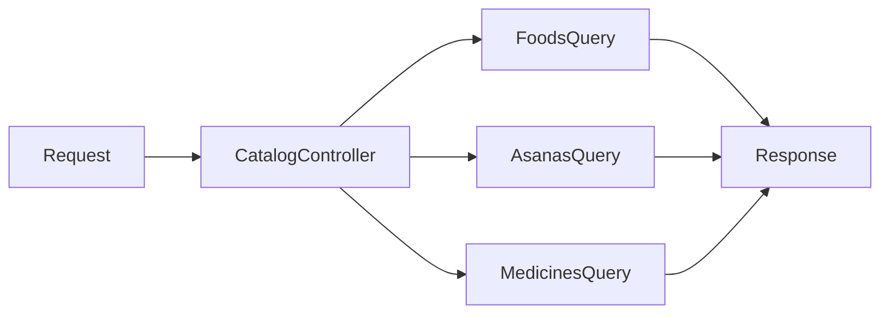

# Backend Catalog Module

## Scope
Implemented in `controllers/catalog.controller.js` and `routes/catalog.routes.js`.

## Endpoint
- `GET /api/catalogs/treatment`

## Purpose
Provide consolidated treatment catalogs for frontend plan-building workflows:
- Foods (+ Ayurvedic properties)
- Asanas
- Medicines

## HLD

## LLD Highlights
- Foods are mapped from `foods` plus first linked `ayurveda_props` record.
- Asanas and medicines are filtered by `is_active = true`.
- Output shape is normalized for frontend consumption.

## Important Tables/Fields
- `foods`: `food_id`, `food_name`, `category`, nutrition values
- `ayurveda_props`: `rasa`, `virya`, `vipaka`, `gunas`, `dosha_impact`
- `asanas`: `name`, `category`, `ayurvedic_properties`, `effect_profile`
- `medicines`: `medicine_name`, `herbs_used`, `ayurvedic_properties`, `medicine_type`
