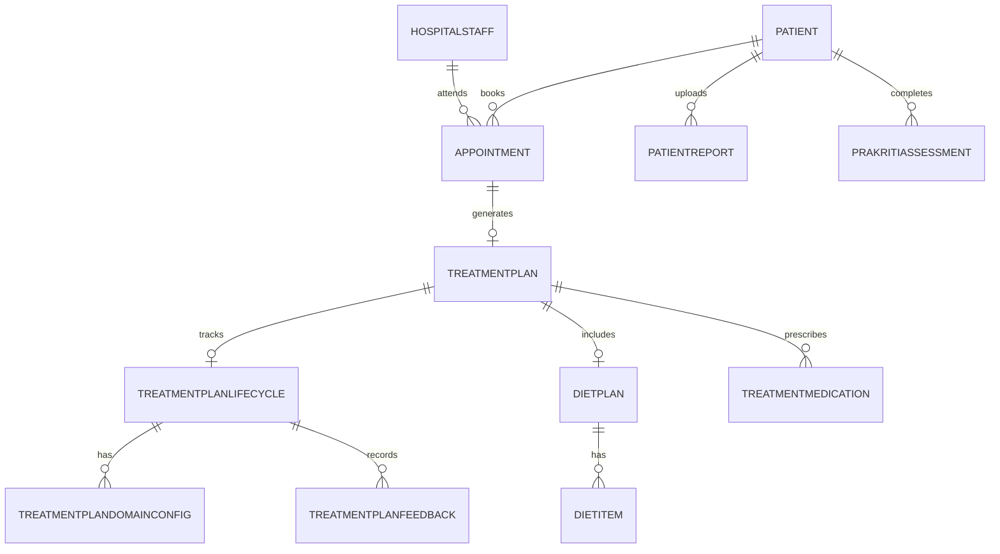

# Backend Database Schema (Prisma)

## Source
`backend/prisma/schema.prisma`

## Core Domain Tables
- `Patient`
- `HospitalStaff`
- `DoctorProfile`
- `Hospital`
- `Department`
- `Appointment`
- `TreatmentPlan`
- `TreatmentPlanLifecycle`
- `TreatmentPlanDomainConfig`
- `TreatmentPlanFeedback`
- `DietPlan`
- `DietItem`
- `TreatmentMedication`
- `PatientReport`
- `PrakritiAssessment`
- Catalog tables: `foods`, `ayurveda_props`, `asanas`, `medicines`

## Relationship Flow

## Important Enums
- `StaffRole`: ADMIN, DOCTOR, ...
- `AppointmentStatus`: SCHEDULED, LIVE, COMPLETED, CANCELLED
- `MealTime`: EARLY_MORNING ... OTHER
- `PlanDomain`: DIET, ASANAS, MEDICINES
- `PlanFeedbackType`: WORKING, NOT_EFFECTIVE, TERMINATE_REQUEST, STOPPED
- `PlanLifecycleStatus`: ACTIVE, WORKING, NOT_EFFECTIVE, STOP_REQUESTED, STOPPED, COMPLETED, SUPERSEDED

## Important JSON/Array Fields
- `Patient.clinicalData` (Json)
- `Appointment.diagnosis`, `dietChart`, `medications`, `routinePlan` (Json)
- `TreatmentPlan.diagnosis`, `dietChart`, `routinePlan` (Json)
- `Patient.allergies` (String[])
- `DoctorProfile.languages`, `caseSummaries`, `education`, `qualifications` (String[])

## LLD Constraints to Note
- `TreatmentPlan.appointmentId` is unique.
- Lifecycle and diet plan are 1:1 with treatment plan.
- Feedback rows are indexed by doctor/patient/treatment plan and timestamp.
- Binary report data stored in DB (`PatientReport.fileData`).
