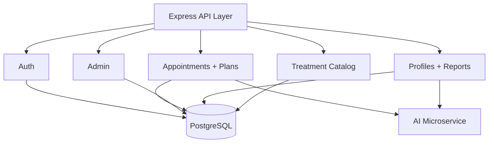

# Backend Overview

## Purpose
Backend is the system-of-record and orchestration layer across user workflows and AI services.

## Entry Points
- Server bootstrap: `backend/src/app.js`
- Prisma config: `backend/src/db/config.js`

## Route Modules
- `auth.routes.js`
- `appointment.routes.js`
- `admin.routes.js`
- `profile.routes.js`
- `catalog.routes.js`

## HLD

## LLD Building Blocks
- `asyncHandler`: async error wrapping
- `ApiError`: typed HTTP error semantics
- `ApiResponse`: uniform response envelope

## Important Cross-Cutting Data Entities
- `Patient`
- `HospitalStaff` and `DoctorProfile`
- `Appointment`
- `TreatmentPlan` + lifecycle tables
- `PatientReport`
- `PrakritiAssessment`
