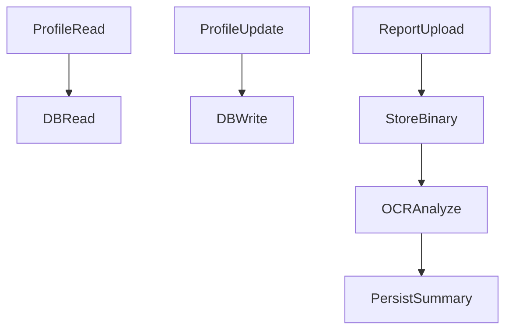

# Backend Profile Module

## Scope
Implemented in `controllers/profile.controller.js` and `routes/profile.routes.js`.

## Responsibilities
- Patient profile retrieval/update
- Doctor profile retrieval/update
- Patient report upload/download/delete/reanalysis
- Profile image serving

## Endpoints
- `GET /api/profile/patient/:id`
- `GET /api/profile/patient/:id/image`
- `PATCH /api/profile/patient/:id`
- `GET /api/profile/doctor/:id`
- `PUT /api/profile/doctor/profile`
- `POST /api/profile/patient/:id/reports`
- `GET /api/profile/patient/:id/reports/:reportId/download`
- `DELETE /api/profile/patient/:id/reports/:reportId`
- `PUT /api/profile/patient/:id/reports/:reportId/reanalyze`

## HLD

## LLD Highlights
### Patient update
- Merges incoming fields with existing patient record.
- Recomputes age from DOB when DOB changes.
- Stores image bytes + mime with 2MB size cap.
- Maintains clinical data sub-structure in `clinicalData` JSON.

### Report pipeline
- Accepts base64 payload for report file.
- Stores binary report (`fileData`) in `PatientReport`.
- Calls AI OCR endpoint to produce summary text.
- Supports manual reanalysis for updated summary generation.

## Important Fields
Patient-level:
- `dateOfBirth`, `age`, `prakriti`, `vikriti`
- `vataScore`, `pittaScore`, `kaphaScore`
- `clinicalData` JSON payload

Report-level:
- `fileName`, `mimeType`, `sizeBytes`, `fileData`, `summary`
