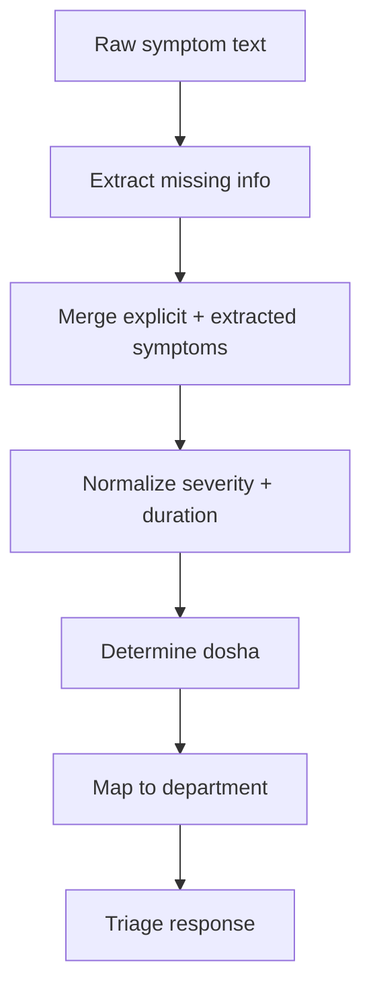

# AI Diagnosis / Triage Module

## Scope
- Endpoint: `POST /api/triage`
- Main files:
  - `app.py` (API layer)
  - `NLP707070.py` (triage logic)

## Input Contract
- `raw_symptoms`
- `explicit_symptoms[]`
- `explicit_severity`
- `explicit_duration`

## Output Contract
- `final_symptoms[]`
- `final_severity`
- `final_duration`
- `dosha_indicator`
- `recommended_department_id`
- `recommended_department_name`
- `recommended_department_description`

## HLD Flow

## LLD Highlights
- Uses both LLM-assisted extraction and deterministic fallback rules.
- Department selection uses keyword-rule matching for consistency.
- Dosha inference is keyword-driven (Pitta/Vata/Kapha signatures).

## Important Internal Functions
- `extract_missing_info()`
- `merge_symptoms()`
- `normalize_severity()`
- `determine_dosha()`
- `determine_department()`

## Data Notes
- Department IDs in NLP module are canonical labels (`d1...d12`) and must align with backend matching behavior.
