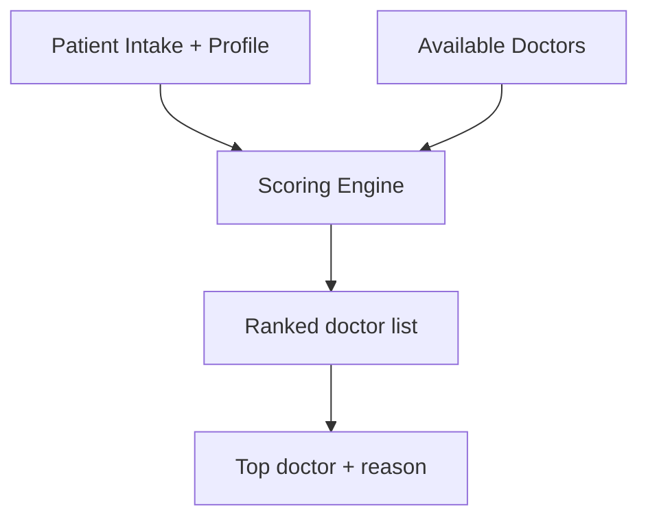

# AI Matchmaker Module

## Scope
Intelligent doctor ranking based on patient profile and clinical context.

## Main File
- `backend/ai-microservice/Matchmaker.py`

## Objective
Select best-fit doctor from available candidates by combining:
- specialization relevance
- dosha-case experience
- success ratio and practice history
- symptom/case overlap

## HLD

## LLD Scoring Factors
- Specialization keyword map (high weight)
- Dosha relevance score from case summaries
- Experience years + success rate boosts
- Symptom and medical-history text overlap

## Important Input Fields
- Intake:
  - `problem_description`, `symptoms`, `severity`, `duration`
- Patient:
  - `prakriti`, `vikriti`, `assessment_summary`, demographic and history fields
- Doctor:
  - `specialization`, `experience_years`, `success_count`, `unsuccessful_count`, `case_summaries`

## Output
- Ranked list of `{ doctor_id, match_score, match_reason }`

## Integration Note
Backend booking flow calls `/api/matchmaker`; deployment should ensure this endpoint is exposed in the running AI service variant.
