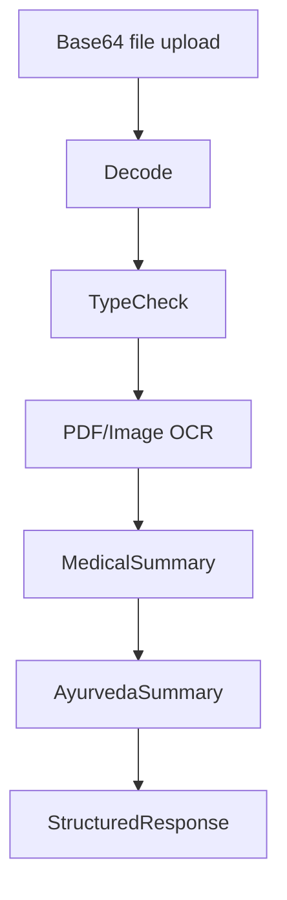

# AI OCR Service Module

## Scope
- Endpoint: `POST /api/medical-ocr/analyze`
- Integrates OCR extraction and medical/ayurvedic summarization.

## Input Contract
- `file_name`
- `mime_type`
- `file_base64`
- `include_ayurveda` (boolean)

## Output Contract
- `summary`
- `medical_summary`
- `ayurvedic_summary` (optional)
- `extracted_text_preview`
- `ocr_char_count`

## HLD

## LLD Highlights
- Base64 decode supports `data:*;base64,` style payloads.
- Size guard: rejects files larger than 15MB.
- PDF extraction uses temporary file path and OCR parser.
- Image extraction uses PIL + pytesseract when available.
- Returns fallback text when document has no extractable content.

## Important Variables
- `_ocr_engines` lazy-loaded function map:
  - `extract_text_from_pdf`
  - `generate_medical_summary`
  - `generate_ayurvedic_summary`
- `include_ayurveda`
- OCR timeout behavior in backend caller (`profile.controller.js`)

## Backend Coupling
Profile report upload and reanalyze routes call this endpoint and persist resulting summary into `PatientReport.summary`.
