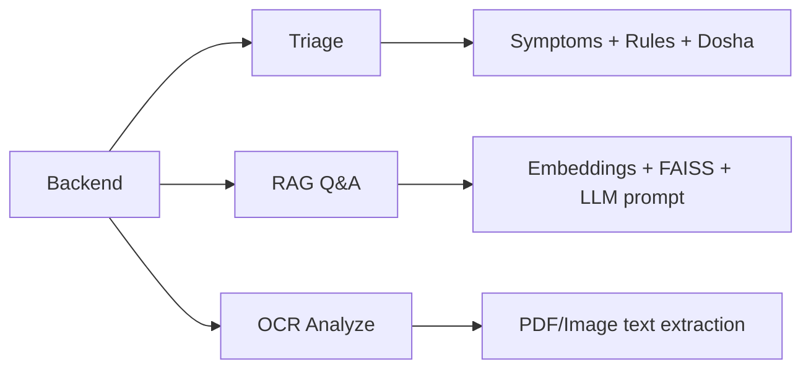

# AI Service Overview

## Scope
FastAPI AI microservice under `backend/ai-microservice/`.

## Modules Covered
- Diagnosis/Triage (`/api/triage`)
- Matchmaker (doctor recommendation logic)
- RAG assistant (`/api/rag/ask`)
- Medical OCR (`/api/medical-ocr/analyze`)

## HLD

## LLD Service Runtime
- `app.py` defines FastAPI contracts and lazy-init strategy.
- Heavy components (RAG/OCR engines) are loaded lazily.
- Failures are converted to explicit HTTP errors and resilient fallbacks.

## Important Runtime Variables
- `_rag_bot`, `_rag_error`
- `_ocr_engines`, `_ocr_error`
- `top_k` for retrieval depth
- `include_ayurveda` for OCR response enrichment
