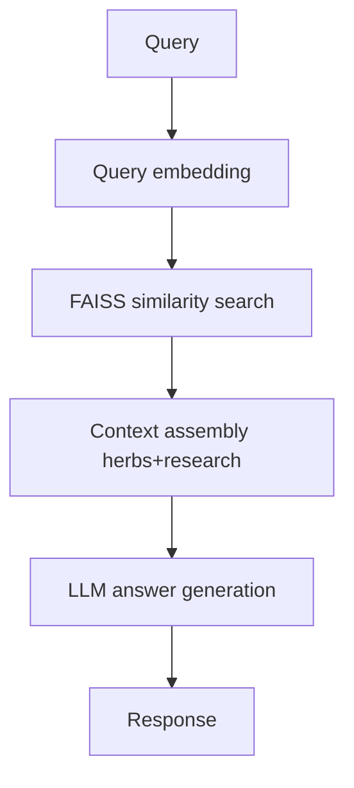

# AI RAG Service Module

## Scope
- Endpoint: `POST /api/rag/ask`
- Core class: `UnifiedAyurvedicRAGBot` in `RAG_MODEL/RAG_code.py`

## Objective
Answer Ayurveda clinical queries using retrieval across:
- herb knowledge base
- PubMed-backed research corpus

## Request/Response
Request:
- `query`
- `top_k` (1 to 10)

Response:
- `answer`
- `confidence`
- `total_sources`
- `processing_time`
- `herb_sources[]`
- `research_sources[]`

## HLD

## LLD Highlights
- Loads embeddings/doc metadata from `knowledge_base` if present.
- Builds FAISS index for cosine-like retrieval (normalized vectors + inner product).
- Uses synonym expansion and dosha keyword heuristics to improve recall.
- Caches query history to reduce repeated heavy processing.

## Important Variables
- `MODEL_NAME` and `OLLAMA_URL`
- `top_k`
- `herb_synonyms`
- `dosha_keywords`
- `faiss_index`, `embeddings`, `all_documents`, `all_metadata`
