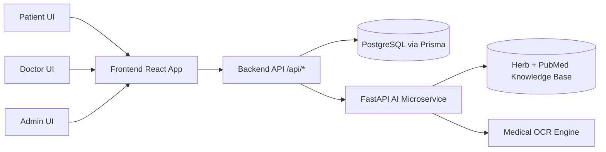

# TriVeda Documentation Hub

This folder contains complete product and engineering documentation for TriVeda.

## Documentation Goals
- Cover every major feature and module separately.
- Explain setup, usage, architecture, and implementation details.
- Provide HLD and LLD views with concrete fields/tables/variables.
- Include diagrams and flowcharts for operational clarity.

## Folder Map
- `00-setup/`
  - Environment and run guides for backend, frontend, and AI microservice.
- `01-architecture/`
  - Cross-system HLD and integration-level logic.
- `02-frontend/`
  - Role-wise frontend modules and UX component rationale.
- `03-backend/`
  - Backend modules: auth, appointments, profiles, admin, CRUD, DB, tech.
- `04-ai-service/`
  - AI modules: triage/diagnosis, matchmaker, RAG, OCR.
- `05-reference/`
  - API and environment variable reference.
  - End-to-end traceability matrix (UI -> API -> DB -> AI).

## Quick Start
1. Read `00-setup/backend-setup.md`
2. Read `00-setup/frontend-setup.md`
3. Read `00-setup/ai-service-setup.md`
4. Read `01-architecture/system-hld.md`

## Primary Runtime Components
- Backend API: Express + Prisma + PostgreSQL (Neon)
- Frontend App: React + Vite + TanStack Query + role-based dashboards
- AI Microservice: FastAPI + NLP triage + RAG + OCR

## End-to-End High-Level Flow

